# ADR 0008: Data Platform (Phase 03)

## Status
Accepted (Phase 03)

## Context
Toss market/account data (Phase 02) and, eventually, DART/news/
strategy/order data all need somewhere reproducible to live -
reproducible meaning two things: (1) re-ingesting the same event twice
never creates a duplicate row, and (2) a query used to train a model
or run a backtest can never see data that was not yet available at the
point in time being simulated ("no lookahead").

## Decision

### Stack
PostgreSQL, `SQLAlchemy` Core (tables, not the ORM - explicit `select`/
`insert`/`update` over identity-map/lazy-loading complexity, matching
this codebase's preference for explicit code), `alembic` for
migrations, `psycopg` (v3) as the driver. `app.core.config.Settings.
database_url` is the only place a connection string is configured
(never hardcoded) - see ADR 0002.

### Module boundaries (extends ADR 0001)
```
db      -> core                        (schema, engine, repositories, quality - no fetching)
ingest   -> core, db, toss, data, research   (orchestration: fetch + write)
```
`app.db` only knows how to store and query rows - it has no import
edge to `app.toss`, `app.research`, `app.brokers`, `app.risk`, or
`app.execution` (statically proven in `tests/db/test_isolation.py`,
mirroring the same proof for `app.research`/`app.toss` from Phase
01/02, which this phase re-checks still holds). `app.ingest` is the
one package allowed to depend on all of `db`/`toss`/`data`/`research`
together - it is where "pull from an external source" and "write
through a repository" meet, and nothing depends on `app.ingest` in
return.

### ERD

```mermaid
erDiagram
    instruments ||--o{ market_bars : has
    instruments ||--o{ trade_ticks : has
    instruments ||--o{ orderbook_snapshots : has
    instruments ||--o{ disclosure_events : "about (nullable)"
    instruments ||--o{ signals : about
    instruments ||--o{ paper_orders : for
    instruments ||--o{ broker_orders : "for (nullable)"
    instruments ||--o{ positions : held

    model_runs ||--o{ signals : produced

    instruments {
        bigint id PK
        text exchange
        text symbol
        text source
    }
    market_bars {
        bigint id PK
        bigint instrument_id FK
        text timeframe
        timestamptz event_time
        timestamptz available_at
        timestamptz ingested_at
        int revision
        numeric open_price
        numeric close_price
    }
    trade_ticks {
        bigint id PK
        bigint instrument_id FK
        timestamptz event_time
        timestamptz available_at
        numeric price
        numeric volume
    }
    orderbook_snapshots {
        bigint id PK
        bigint instrument_id FK
        timestamptz event_time
        jsonb asks
        jsonb bids
    }
    news_events {
        bigint id PK
        text source
        text external_id
        timestamptz event_time
        timestamptz available_at
        int revision
    }
    disclosure_events {
        bigint id PK
        text source
        text external_id
        bigint instrument_id FK
        timestamptz event_time
        int revision
    }
    strategy_registry {
        bigint id PK
        text strategy_id
        text version
        text status
        jsonb spec_json
    }
    model_runs {
        bigint id PK
        text model_name
        text status
        text idempotency_key
    }
    signals {
        bigint id PK
        bigint model_run_id FK
        bigint instrument_id FK
        timestamptz event_time
        timestamptz available_at
    }
    backtest_runs {
        bigint id PK
        text strategy_id
        text idempotency_key
    }
    paper_orders {
        bigint id PK
        text client_order_id
        bigint instrument_id FK
        text status
    }
    broker_orders {
        bigint id PK
        text broker_order_id
        text client_order_id
        bigint instrument_id FK
    }
    positions {
        bigint id PK
        text account_id
        bigint instrument_id FK
        timestamptz event_time
        timestamptz available_at
        numeric quantity
    }
    account_snapshots {
        bigint id PK
        text account_id
        timestamptz event_time
        timestamptz available_at
        jsonb raw_payload
    }
    system_events {
        bigint id PK
        text event_type
        text severity
        text dedup_key
    }
```



### Three column conventions
Every table is one of (see `app/db/schema.py` module docstring):

1. **Revisioned observed-event** (`market_bars`, `news_events`,
   `disclosure_events`): `event_time`/`available_at`/`ingested_at` as
   below, plus an integer `revision`. `available_at` is *part of* the
   natural key, so a correction appends a new revision row instead of
   overwriting - see "Corrections do not leak into the past" below and
   `app.db.upsert.append_revision_rows`.
2. **Plain observed-event** (`trade_ticks`, `orderbook_snapshots`,
   `signals`, `positions`, `account_snapshots`): `event_time` (when it
   happened), `available_at` (when we could first have known it),
   `ingested_at` (last write). A natural-key `UniqueConstraint` (NOT
   including `available_at`) makes re-ingestion idempotent via
   `app.db.upsert.upsert_event_rows` (`INSERT ... ON CONFLICT DO
   UPDATE`, `available_at` excluded from the `SET` clause so it is
   preserved from first insert). Not expected to receive external
   corrections - see ADR 0009 for the scope decision.
3. **Operational run** (`model_runs`, `backtest_runs`): our own
   pipeline executions - `started_at`/`finished_at`/`status` plus a
   nullable-but-unique `idempotency_key` (`app.db.repositories.
   _idempotent_insert.get_or_insert`) so resuming after a restart with
   the same key returns the existing run instead of duplicating it.
4. **Order** (`paper_orders`, `broker_orders`): our own actions -
   unique on `client_order_id` (mirrors `app.brokers.base.OrderRequest`
   from Phase 00) / `(broker_order_id, source)`.

`strategy_registry` and `system_events` are dimension/audit tables
with their own natural keys (`(strategy_id, version)`, `dedup_key`)
following the same "never guess, always dedupe" spirit.

### Idempotency rules (summary - see `app/db/schema.py` per table)
| Table | Natural key |
|---|---|
| instruments | `(exchange, symbol)` |
| market_bars | `(instrument_id, timeframe, event_time, source, available_at)` - revisioned, see below |
| trade_ticks | `(instrument_id, event_time, source, price, volume)` * |
| orderbook_snapshots | `(instrument_id, event_time, source)` |
| news_events | `(source, external_id, available_at)` - revisioned, see below |
| disclosure_events | `(source, external_id, available_at)` - revisioned, see below |
| strategy_registry | `(strategy_id, version)` |
| signals | `(model_run_id, instrument_id, event_time)` |
| model_runs | `idempotency_key` (nullable - only when resumability matters) |
| backtest_runs | `idempotency_key` (same) |
| paper_orders | `client_order_id` |
| broker_orders | `(broker_order_id, source)` |
| positions | `(account_id, instrument_id, event_time, source)` |
| account_snapshots | `(account_id, event_time, source)` |
| system_events | `dedup_key` (nullable - only when de-duplication is wanted) |

\* Toss's confirmed `trade` DTO (ADR 0007) has no trade id, so two
genuinely distinct trades sharing timestamp+price+volume are
indistinguishable and the second is dropped - a documented limitation,
not a bug.

### Point-in-time reads (the anti-lookahead guarantee)
Every historical read method in `app.db.repositories` for an
observed-event table takes a **required** `as_of: datetime` parameter
and filters `available_at <= as_of` - there is no "get everything"
method for these tables, so a caller (a backtest, a training pipeline,
a scanner) cannot accidentally see data that only became available
after the point in time it is simulating. See
`tests/db/test_point_in_time.py` for the walk-forward-style proof: as
`as_of` advances day by day, a day's bar only ever appears once its
own `available_at` has passed, never before - even though all ten
days of bars already exist in the table from a single backfill.

**Corrections do not leak into the past.** For tables where an
external source can issue a correction with new values at a later
`available_at` (`market_bars`, `news_events`, `disclosure_events`),
`app.db.upsert.append_revision_rows` inserts the correction as a new,
separate revision row rather than updating the original in place -
`available_at` is part of the natural key, not excluded from it. A
point-in-time read (`app.db.repositories._revisions.
select_latest_revision_as_of`) then picks, per logical event, the
revision with the greatest `available_at <= as_of`; a revision whose
`available_at` is after the query's `as_of` is excluded from the
candidate set entirely, so it structurally cannot be selected. See
ADR 0009 (amended) for why the earlier "update in place, keep the
original `available_at`" design was a real point-in-time information
leak - not an acceptable simplification - and
`tests/db/test_point_in_time_correction.py` for the regression suite
locking in the fixed behavior (the exact "value=100 on 09-01, corrected
to 105 on 09-03" scenario, idempotent resubmission, and "ingesting a
correction never changes a past `as_of` result").

Tables not expected to receive external corrections (`trade_ticks`,
`orderbook_snapshots`, `signals`, `positions`, `account_snapshots`)
keep the simpler `upsert_event_rows` (`ON CONFLICT DO UPDATE`,
`available_at` preserved from first insert, values updated in place)
- see ADR 0009 for that scope decision and how to extend the
revisioned pattern to one of them later if it changes.

### Ingest flow
`app.ingest` pulls from a source and writes through a repository:
- `MarketBarIngestor` (`app/ingest/market_data_ingestor.py`): calls
  `app.toss.market_data.MarketDataAdapter.get_candles(...)` (Phase 02,
  read-only) and upserts the normalized `Candle`s via
  `MarketBarRepository`.
- `NewsIngestor` / `DisclosureIngestor`: call a `NewsCollector` /
  `DisclosureCollector` `Protocol` and upsert through
  `NewsRepository` / `DisclosureRepository`. `MockNewsCollector` /
  `MockDisclosureCollector` are the only implementations right now (no
  real news/DART API is integrated yet) - a real collector is an
  additive implementation of the same `Protocol`, nothing else in the
  ingestor changes.
- `StrategyRegistrySync` (`app/ingest/strategy_sync.py`): the one
  place `app.research` (file-based Strategy Registry, source of
  truth - ADR 0006) and `app.db` (`strategy_registry` table, a
  queryable mirror) meet. Neither package depends on the other.
- `IngestScheduler` (`app/ingest/scheduler.py`): a minimal,
  dependency-free interval scheduler - `register_job(name, interval,
  fn)`, `tick()` runs every due job. No cron/APScheduler dependency;
  a real trigger (cron, a loop, a task queue) calls `tick()`
  periodically. Fake-clock injectable for deterministic tests.

### Data quality metrics (`app/db/quality.py`)
Computed from real SQL, not inferred from row counts (which
structurally can't show duplicates once upserted away):
- **Missing bars**: `expected_bar_count` (from a caller-supplied
  interval) vs. `actual_bar_count` in a range - accurate for a
  fixed-interval timeframe, an over-count for a calendar-gapped one
  (e.g. daily bars skip weekends/holidays - no trading calendar exists
  yet, see ADR 0009).
- **Latency**: `AVG`/`MAX` of `ingested_at - event_time`.
- **Staleness**: seconds since `MAX(ingested_at)`, compared to a
  caller-supplied threshold.
- **Duplicates**: `compute_duplicate_count(attempted, rows_before,
  rows_after)` - "how many of an ingestion batch matched an existing
  key" is computed from before/after counts around an upsert call, not
  read back from the table afterward (there are never duplicate rows
  to count there by construction).
- **Success rate**: `compute_success_rate` reads `system_events`
  (severity convention: `INFO` = success, `WARNING` = degraded,
  `ERROR` = failed) for a `(event_type, source)` since a given time.

## Consequences
- Every table's migration is generated from `app/db/schema.py`'s
  `MetaData` via `alembic revision --autogenerate` (not hand-written
  DDL) - schema and migration cannot drift from each other by
  construction. `tests/db/test_migrations.py` proves `upgrade head` /
  `downgrade base` / `upgrade head` round-trips cleanly against a real
  PostgreSQL instance.
- `tests/db/` and `tests/ingest/` run against a real local PostgreSQL
  (not mocked) because migration DDL, `ON CONFLICT` upsert semantics,
  and `DISTINCT ON` point-in-time queries are genuinely
  Postgres-specific - faking them would test nothing real. They skip
  gracefully (`pytest.skip`, not a failure) if `TEST_DATABASE_URL` is
  unreachable, so `make test` still passes in an environment with no
  Postgres, matching the opt-in pattern ADR 0007 established for the
  live Toss integration test.
- Phase 04's Scanner reads through `app.db.repositories` exclusively
  (see the Phase 03 completion report for the exact API surface) - it
  never needs to know about `available_at`/idempotency mechanics
  directly, only that every historical read requires `as_of`.
